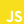
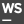

## Hi 👋, I'm Alexey Ivanov aka [randmaru](http://github.com/randmaru)

# I'm Frontend Developer and Student!

- 👨‍💼 I’m currently working in [Antares Software Group](http://github.com/Antares-Software)

- 🏫 I'm study at [Yaroslav-the-Wise Novgorod State University](http://novsu.ru)

- 📖 I’m currently learning: **React.js, TypeScript and Node.js**

- 📧 How to reach me: [Telegram](http://t.me/randmaru), git.randmaru@ya.ru

---

### **My skills**:

<dl>
  <dt><b>Web basics:</b></dt>
    <dd>&nbsp;&nbsp;&nbsp;</dd>
  <dt><b>Programming languages:</b></dt>
    <dd>&nbsp;&nbsp;</dd>
  <dt><b>Runtime systems:</b></dt>
    <dd>&nbsp;</dd>
  <dt><b>DBMS:</b></dt>
    <dd>&nbsp;</dd>
  <dt><b>Frameworks:</b></dt>
    <dd>&nbsp;&nbsp;</dd>
  <dt><b>Libraries:</b></dt>
    <dd>&nbsp;&nbsp;</dd>
  <dt><b>Programming tools:</b></dt>
    <dd>&nbsp;&nbsp;&nbsp;</dd>
  <dt><b>Design tools:</b></dt>
    <dd>&nbsp;&nbsp;&nbsp;</dd>
</dl>
